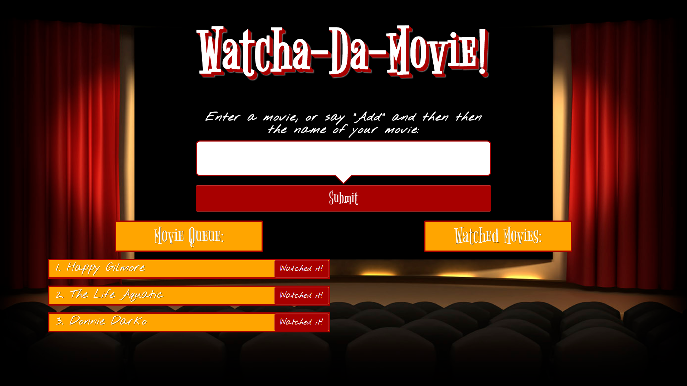
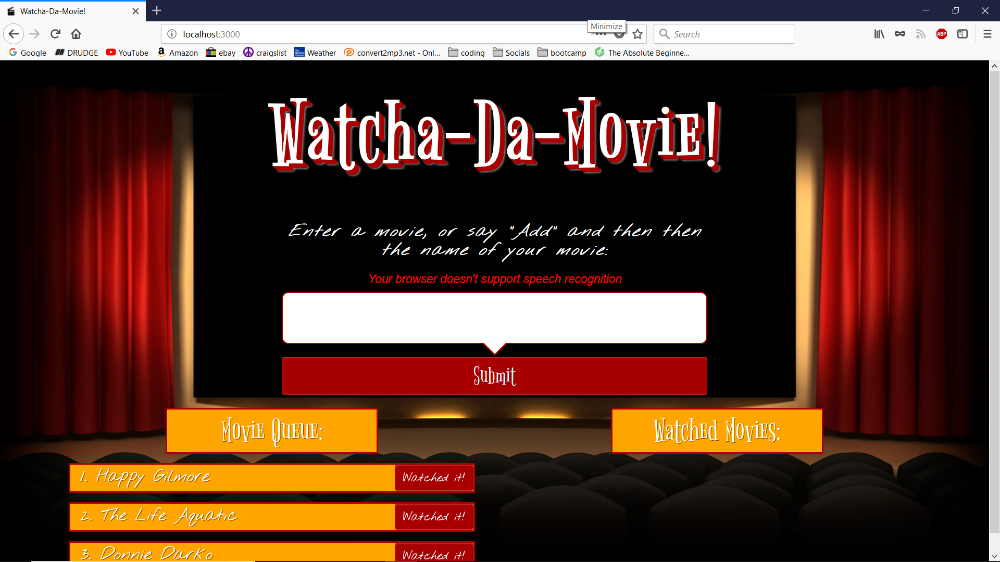
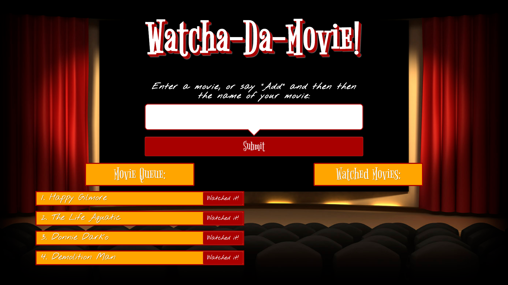
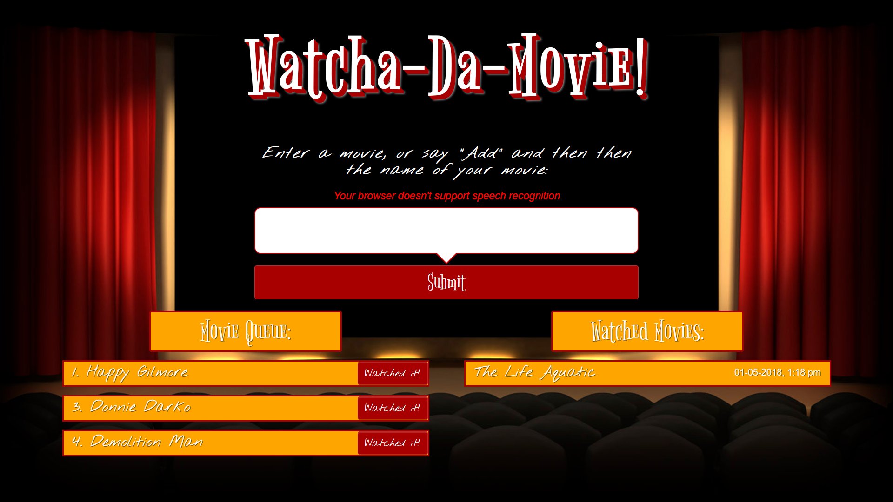
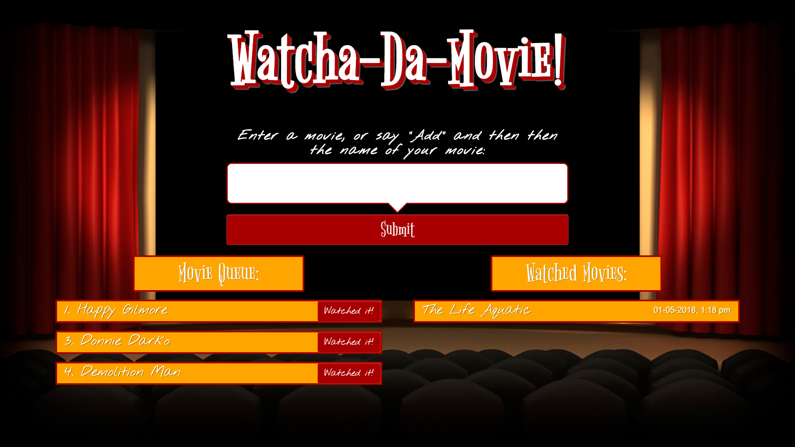

# Watcha-Da-Movie!

## To view a live version of this app, [click here.](https://principio-movie-list.herokuapp.com/)
### (If you have a microphone, Chrome is the recommended browser to utilize voice activated movie adding)

## Technologies used:
* HTML5
* CSS3
* Bootstrap 3
* Javascript
* jQuery
* Handlebars.js
* Node.js
* Express
* MySQL (with a homemade ORM)
* Moment.js
* AJAX
* API's:
  * AnnYang voice recognition API
  * YouTube API
  * OMDB API
* MVC framework
* Google Fonts

##### Future improvements include authentication with Passport.js to allow for multiple users

## This is a single page application where users can add movies they would like to watch, and keep a record of movies they have watched, and when.

## Movies may be added by typing into the text bubble, or by saying the word "Add", and then the name of the movie:

## Once a movie has been added, you can click on the title to open a modal.  This modal contains information about the movie, as well as a trailer for the movie:

## If the the trailer is not the correct one, or you would like to see more than one, you can load the next video by clicking the button:

## The app detects if your browser allows voice adding of movies, and notifies you:

## When you have watched a movie, click the "watched it" button, and it will move into your "watched movies" category with a timestamp added, so you can keep track of what you have watched and when:

